# Architecture diagram — full system

A single mermaid diagram of every meaningful component and data flow. Use this when you want to know *where something fits* — for the prose explanation of any one box, follow the link in the catalogue below the diagram.

For more focused diagrams, see [`motion-guard.md`](motion-guard.md) (motion routing only) and the ASCII picture in [`rocky-architecture.md`](rocky-architecture.md) (orchestration core).

## The whole system

```mermaid
flowchart TB
    classDef ui          fill:#1c2540,stroke:#5a7bff,color:#fff
    classDef orch        fill:#142838,stroke:#4aa8ff,color:#fff,font-weight:bold
    classDef cognition   fill:#1f2f1a,stroke:#7ec24a,color:#fff
    classDef voice       fill:#3a1f2f,stroke:#ff4a9a,color:#fff
    classDef perception  fill:#2a2a4a,stroke:#9b7ed8,color:#fff
    classDef telemetry   fill:#3a3318,stroke:#d8b54a,color:#fff
    classDef robotlink   fill:#3a1f1f,stroke:#ff7a4a,color:#fff
    classDef memory      fill:#1a2a2a,stroke:#4ad8d8,color:#fff
    classDef sidecar     fill:#2a2a2a,stroke:#aaa,color:#fff
    classDef guard       fill:#5f1f1f,stroke:#ff4a4a,color:#fff,font-weight:bold
    classDef bot         fill:#1f3f1f,stroke:#4aff4a,color:#fff,font-weight:bold
    classDef daemon      fill:#000,stroke:#fff,color:#fff
    classDef ext         fill:#3a2a4a,stroke:#c87aff,color:#fff
    classDef store       fill:#2a3a2a,stroke:#8acc8a,color:#fff

    %% =============================================================
    %% External services
    %% =============================================================
    subgraph external ["External services"]
        LMStudio["LM Studio<br/>localhost:1234<br/>(text-only brain fallback)"]:::ext
        Brave["Brave Search API"]:::ext
        HF["HuggingFace Hub<br/>(model downloads)"]:::ext
    end

    %% =============================================================
    %% Mac app — UI surfaces
    %% =============================================================
    subgraph macui ["Mac app — UI surfaces"]
        RootView["RootView<br/>WindowGroup"]:::ui
        Conv["ConversationView<br/>chat transcript + tool calls"]:::ui
        Cockpit["CockpitView<br/>avatar · senses · mic · wake"]:::ui
        Inspector["InspectorView<br/>Health · Activity · Memory ·<br/>Motion · Vision · Profile · Raw"]:::ui
        Settings["SettingsView<br/>Robot · Brain · Voice · Memory ·<br/>Wake · Face · Sidecars"]:::ui
        MenuBar["MenuBarExtra<br/>SF-symbol state · quick actions"]:::ui
        ProfileTab["ProfileTab<br/>turn waterfalls · p50/p95"]:::ui
        LogsView["LogsView<br/>TelemetryEvent feed"]:::ui
    end

    RootView --> Conv
    RootView --> Cockpit
    RootView --> Inspector
    RootView --> Settings
    Inspector --> ProfileTab
    Inspector --> LogsView

    %% =============================================================
    %% Orchestration core
    %% =============================================================
    subgraph orchestration ["Orchestration"]
        AppServices["AppServices<br/>@Observable · @MainActor singleton<br/>holds every actor"]:::orch
        SettingsStore["SettingsStore<br/>UserDefaults · persona · endpoints"]:::store
        LogBus["LogBus<br/>actor · TelemetryEvent multicast"]:::telemetry
    end

    RootView -. "@Environment" .-> AppServices
    AppServices --- SettingsStore
    AppServices --- LogBus

    %% =============================================================
    %% Cognition stack
    %% =============================================================
    subgraph cog ["Cognition"]
        Cognition["CognitionEngine<br/>actor · runStream loop ·<br/>speech-dedup · brain rounds"]:::cognition
        FastPath["FastPath<br/>regex intents (time, weather,<br/>news, greeting)"]:::cognition
        Tools["ToolRegistry<br/>actor · dispatch + schemas"]:::cognition
        MLXVLM["MLXVLMBrain<br/>SidecarRuntime adapter"]:::cognition
        LMStudio2["LMStudioBrain<br/>HTTP client"]:::cognition
    end

    AppServices --> Cognition
    Cognition --> FastPath
    Cognition --> Tools
    Cognition --> MLXVLM
    Cognition --> LMStudio2
    LMStudio2 -.-> LMStudio

    %% =============================================================
    %% Voice pipeline
    %% =============================================================
    subgraph voice ["Voice"]
        Mic["MicService<br/>AVAudioEngine 16 kHz mono"]:::voice
        Ring["AudioRingBuffer"]:::voice
        VC["VoiceCoordinator<br/>actor · VAD + segment flush"]:::voice
        VAD["EnergyVAD / SileroVAD"]:::voice
        STT["MLX-Whisper-STT /<br/>WhisperKit / Apple Speech"]:::voice
        Wake["WakeFilter<br/>wake word + conv window"]:::voice
        Addr["AddressFilter<br/>strict multi-signal gate<br/>(loudness · DoA · face · STT)"]:::voice
        RobotTTSActor["RobotTTS<br/>actor · synth → upload → play"]:::voice
        StreamTTS["StreamingTTS<br/>actor · isSpeaking signal +<br/>echo-gate timer"]:::voice
    end

    Mic --> Ring
    Ring --> VC
    VC --> VAD
    VC --> STT
    VC --> Wake
    AppServices --> Addr
    Wake --> Addr
    Addr --> Cognition

    %% =============================================================
    %% Perception
    %% =============================================================
    subgraph perc ["Perception"]
        FaceTracker["MacFaceTracker<br/>actor · Apple Vision · 50 Hz<br/>damped controller + body follow<br/>(±60° head / ±90° body cap)"]:::perception
        FaceLib["FaceLibrary<br/>feature-prints · identity"]:::perception
    end

    AppServices --> FaceTracker
    FaceTracker --> FaceLib

    %% =============================================================
    %% Memory
    %% =============================================================
    Memory["MemoryService<br/>actor · pre-turn recall +<br/>post-turn record"]:::memory
    AppServices --> Memory
    Cognition --> Memory

    %% =============================================================
    %% Telemetry
    %% =============================================================
    subgraph tel ["Telemetry"]
        Moments["MomentFeed<br/>narrative coalescer"]:::telemetry
        Profiler["TurnProfiler<br/>per-turn aggregator"]:::telemetry
        ProfileStore["ProfileStore<br/>rolling 50-turn history"]:::store
    end

    LogBus --> Moments
    LogBus --> Profiler
    Profiler --> ProfileStore
    Moments --> Conv
    ProfileStore --> ProfileTab

    %% Major event publishers
    VC -- "vadSegment · sttFinal" --> LogBus
    Addr -- "addressFilterAccept / Drop" --> LogBus
    Cognition -- "llmRequest · brainResponse" --> LogBus
    Tools -- "toolInvocation" --> LogBus
    RobotTTSActor -- "ttsRequest ·<br/>audioPlaybackStarted" --> LogBus

    %% =============================================================
    %% RobotLink + MotionGuard (the chokepoint)
    %% =============================================================
    subgraph rl ["RobotLink"]
        MotionGuard["MotionGuard (Mac)<br/>━━━━━━━━━━━━━━━━━━<br/>setTarget · slew limit<br/>goto · velocity + duration + in-flight<br/>playRecordedMove · shelf-safe allowlist<br/>head-body yaw delta ≤ 65°"]:::guard
        TargetStreamer["TargetStreamer<br/>50 Hz set_target loop"]:::robotlink
        RobotLink["RobotLinkClient<br/>HTTP · path-aware routing"]:::robotlink
        StateSub["StateSubscriber<br/>state WS · backoff"]:::robotlink
        MediaClient["MediaClient<br/>sound upload + play_sound"]:::robotlink
    end

    Tools -- "say · express · play_emotion ·<br/>look_at_object · look_at ·<br/>go_home · go_to_sleep ·<br/>stop_motion · set_motor_mode" --> MotionGuard
    FaceTracker -- "50 Hz update" --> TargetStreamer
    TargetStreamer --> MotionGuard
    RobotTTSActor --> MediaClient
    StreamTTS -. "isSpeakingStream → ttsBusyUntil" .-> AppServices
    MotionGuard --> RobotLink
    MediaClient --> RobotLink
    StateSub -. "headPose · bodyYaw ·<br/>antennas · ctrl_mode" .-> AppServices

    %% =============================================================
    %% Mac sidecars (subprocesses launched by SidecarHost)
    %% =============================================================
    subgraph macsidecars ["Mac sidecars · stdin/stdout JSON · SidecarHost convention"]
        BrainSC["brain<br/>mlx-vlm · Qwen3-VL 4B /<br/>Gemma 4 26B-A4B · vision"]:::sidecar
        STTSC["mlx-stt<br/>whisper-medium-mlx"]:::sidecar
        TTSSC["mlx-tts<br/>chatterbox-8bit /<br/>qwen3-tts / fish"]:::sidecar
        MemSC["mempalace<br/>ChromaDB · ICL embeddings"]:::sidecar
        RMicSC["robot-mic<br/>WS ← :8042/ws/audio"]:::sidecar
        RCamSC["robot-camera<br/>WS ← :8042/ws/video"]:::sidecar
    end

    MLXVLM -.-> BrainSC
    STT -.-> STTSC
    RobotTTSActor -.-> TTSSC
    Memory -.-> MemSC
    Ring -.-> RMicSC
    FaceTracker -.-> RCamSC
    BrainSC -.- HF
    STTSC -.- HF
    TTSSC -.- HF
    MemSC -.- HF

    %% Brain tool: search_web hits external API
    Tools -.-> Brave

    %% =============================================================
    %% Robot (CM4 onboard, Wireless build)
    %% =============================================================
    subgraph bot ["Reachy Mini — CM4 onboard"]
        Relay["rocky_media_relay (:8042)<br/>FastAPI sub-app inside daemon"]:::bot
        BotGuard["MotionGuard (Python, on-bot)<br/>mirrors all five Mac guards +<br/>yaw-delta + shelf-safe allowlist"]:::guard
        BotMedia["Media relay endpoints<br/>/ws/audio · /ws/video ·<br/>/battery · /health"]:::bot
        Daemon["reachy_mini_daemon<br/>127.0.0.1:8000<br/>(firewall to localhost only)"]:::daemon
        Motors[(Dynamixel motors<br/>Stewart head · body yaw ·<br/>antennas)]:::daemon
        Speaker[(Robot speaker<br/>GStreamer playbin)]:::daemon
        Camera[(Robot camera<br/>IMX708 wide-angle)]:::daemon
        BotMic[(ReSpeaker mic array<br/>DoA-aware)]:::daemon
    end

    %% Mac → bot wires
    RobotLink -- "POST :8042/api/motion/*<br/>(set_target · goto · play_emotion ·<br/>wake_up · sleep · motor_mode · stop)" --> Relay
    RobotLink -- "GET :8000/api/state/full<br/>(read-only)" --> Daemon
    RobotLink -. "WS :8000/api/state/ws/full" .-> Daemon
    MediaClient -- "POST :8000/api/media/*<br/>(sound upload + play_sound)" --> Daemon

    %% Inside the bot
    Relay --> BotGuard
    Relay --> BotMedia
    BotGuard -- "POST 127.0.0.1:8000/api/move/*" --> Daemon
    Daemon -- "Dynamixel · USB serial" --> Motors
    Daemon -- "play_sound · GStreamer" --> Speaker
    Camera --> BotMedia
    BotMic --> BotMedia

    %% Camera + mic flow back to Mac
    BotMedia -. "WS /ws/video JPEG ~15 fps" .-> RCamSC
    BotMedia -. "WS /ws/audio 16 kHz mono +<br/>DoA envelopes" .-> RMicSC

    %% 3rd-party clients have nowhere else to go
    Other["Other clients<br/>(3rd-party SDK app, debug curl)"]:::ext
    Other -. "MUST go via :8042" .-> Relay
```

The orange box is the Mac-side `MotionGuard`. The red box is the on-bot `MotionGuard` (Python, inside `rocky_media_relay`). Every motion-bearing arrow passes through *both*. State reads (the dotted line from `RobotLinkClient` to `Daemon`) skip both — they don't move anything.

## Where each thing lives

### Mac app

| Component | Lives in | Concept doc |
|---|---|---|
| `AppServices` | `Sources/Rocky/AppServices.swift` | [app-services](app-services.md) |
| `SettingsStore` | `Sources/Rocky/SettingsStore.swift` | — |
| `LogBus` · `TelemetryEvent` | `Sources/Telemetry/` | [telemetry-pipeline](telemetry-pipeline.md) |
| `MomentFeed` | `Sources/Telemetry/MomentFeed.swift` | [telemetry-pipeline](telemetry-pipeline.md) |
| `TurnProfiler` · `ProfileStore` | `Sources/Telemetry/TurnProfiler.swift` | — |
| `CognitionEngine` · `FastPath` · `ToolRegistry` | `Sources/Cognition/` | [fast-path](fast-path.md) · [tools-registry](tools-registry.md) |
| `MLXVLMBrain` · `LMStudioBrain` | `Sources/Cognition/` | [brain-sidecar](brain-sidecar.md) |
| `VoiceCoordinator` · `EnergyVAD` · `SileroVAD` | `Sources/Voice/` | [voice-pipeline](voice-pipeline.md) |
| `MLXWhisperSTT` · `WhisperKitSTT` · `AppleSpeechSTT` | `Sources/Voice/` | [voice-pipeline](voice-pipeline.md) |
| `WakeFilter` · `AddressFilter` | `Sources/Voice/` | [address-filter](address-filter.md) |
| `RobotTTS` · `StreamingTTS` | `Sources/Voice/` | [tts-engines](tts-engines.md) |
| `MacFaceTracker` · `FaceLibrary` | `Sources/Perception/` | [face-tracker](face-tracker.md) |
| `MotionGuard` (Mac) | `Sources/RobotLink/MotionGuard.swift` | [motion-guard](motion-guard.md) |
| `RobotLinkClient` · `RobotEndpoint` | `Sources/RobotLink/` | — |
| `TargetStreamer` · `StateSubscriber` · `MediaClient` | `Sources/RobotLink/` | [motion-philosophy](motion-philosophy.md) · [state-subscription](state-subscription.md) |
| `MemoryService` | `Sources/Memory/` | [memory](memory.md) |
| `SidecarHost` (runtime, supervisor, manifest) | `Sources/SidecarHost/` | [sidecar-convention](sidecar-convention.md) · [sidecar-supervisor](sidecar-supervisor.md) |
| UI tree (Conversation · Cockpit · Inspector · Settings · MenuBar) | `Sources/Rocky/…View.swift` | [cockpit-design](cockpit-design.md) · [portrait](portrait.md) |

### Sidecars on the Mac (subprocesses)

Each lives under `Sidecars/<name>/` with a `manifest.json` + `setup.sh` + `runner.py`. The Python venv is created lazily on first run and stored in `~/Library/Application Support/Rocky/sidecars/<name>/.venv/`.

| Sidecar | Purpose | Notes |
|---|---|---|
| `brain` | mlx-vlm runtime. Loads Qwen3-VL-4B by default; user can swap to any mlx-vlm-compatible HF id or local path | [brain-sidecar](brain-sidecar.md) |
| `mlx-stt` | whisper-medium-mlx. Selected via `SettingsStore.sttEngine = "mlx-whisper"` | [voice-pipeline](voice-pipeline.md) |
| `mlx-tts` | chatterbox-8bit by default; qwen3-tts and fish backends also wired. HF model id is per-backend env var | [tts-engines](tts-engines.md) |
| `mempalace` | ChromaDB drawer store + recall | [memory](memory.md) |
| `robot-mic` | Pulls `:8042/ws/audio` from the on-bot relay and republishes to `VoiceCoordinator` | — |
| `robot-camera` | Pulls `:8042/ws/video`, decodes JPEG, feeds `MacFaceTracker` + brain `imageProvider` | — |

### Robot (CM4 onboard, Wireless)

| Component | Lives in | What it does |
|---|---|---|
| `rocky_media_relay` | `OnBot/rocky_media_relay/` | FastAPI sub-app under the daemon at `:8042`. Owns all motion endpoints (`/api/motion/*`), audio/video WebSockets, and battery readout. |
| `MotionGuard` (Python) | `OnBot/rocky_media_relay/rocky_media_relay/motion_guard.py` | Mirrors the Mac guard: same five rules + 65° head-body yaw delta + allowlist. Forwards to `127.0.0.1:8000/api/move/*`. |
| `reachy_mini_daemon` | Pollen-installed | The hardware abstraction. Position-clamps to ±180°/±160°/±40° and the 65° head-body delta. No velocity or slew limits. |
| Dynamixel motors · IMX708 camera · ReSpeaker mic · speaker | Hardware | All routed via the daemon. |

### External

| Service | What it provides |
|---|---|
| Hugging Face Hub | First-run model downloads for all four sidecars (brain · stt · tts · mempalace embeddings) |
| LM Studio | Fallback text-only brain. Used when `SettingsStore.brainBackend = "lm-studio"` or when `auto` + the mlx-vlm sidecar isn't built. |
| Brave Search API | The `search_web` brain tool. API key in `SettingsStore.braveSearchAPIKey`. |

## Key data flows

The diagram shows nodes and their connections; here are the four flows that actually move bytes:

1. **User speech → brain → audio out**
   `BotMic → :8042/ws/audio → robot-mic sidecar → AudioRingBuffer → VoiceCoordinator (VAD + STT) → WakeFilter → AddressFilter → CognitionEngine → ToolRegistry → say tool → RobotTTS → mlx-tts sidecar → MediaClient → :8000/api/media/play_sound → robot speaker.`

2. **Camera frame → face tracking → motion**
   `Camera → :8042/ws/video → robot-camera sidecar → MacFaceTracker (Apple Vision + damper) → TargetStreamer → MotionGuard (Mac) → :8042/api/motion/set_target → MotionGuard (on-bot) → 127.0.0.1:8000/api/move/set_target → motors.`

3. **Brain tool call (e.g. `look_at_object`)**
   `Cognition → ToolRegistry → look_at_object handler → MotionGuard.goto → :8042/api/motion/goto → MotionGuard (on-bot, validates) → daemon goto → motors.` Face tracker is disabled and `targetStreamer.latest` is updated to the look-at pose so the head holds it.

4. **State read (read-only, skips both guards)**
   `AppServices → StateSubscriber → :8000/api/state/ws/full (WebSocket) → AppServices.lastRobotState (mirrored on @MainActor).`

## Updating this diagram

When the architecture changes:
- Add/move/rename a node → update both the mermaid block and the "Where each thing lives" table.
- Add a new motion endpoint → update [`motion-guard.md`](motion-guard.md) (route table + diagram) AND this diagram.
- Add a new sidecar → add a row in the sidecars table AND a node in the `macsidecars` subgraph.
- Touch any persona / wake / address rule that changes a dispatch path → update [`voice-pipeline.md`](voice-pipeline.md) and the dataflow above.
