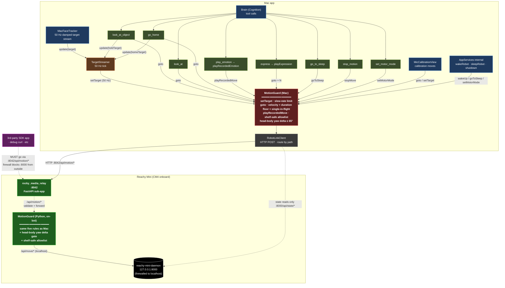

# Motion Guard

Every motion command Rocky issues — face-tracker pushes, look-at-object gotos, recorded emotion playbacks, wake-up sequences, calibration moves, *anything* that moves a joint — **must route through `MotionGuard`** (`Sources/RobotLink/MotionGuard.swift`). It is the single chokepoint where every safety constraint is enforced.

## Why a chokepoint

Earlier builds had safety logic scattered across call sites: `MacFaceTracker` had its own joint clamps, `LookAtTool` had its own comfort caps, `RobotLinkClient.safeGotoDuration` had a velocity check that only covered head pose, and `playRecordedEmotion` had a velocity watchdog that only fired *during* a move. Several real incidents resulted:

- A `dance3` recorded emotion knocked Rocky off his desk shelf — the move was authored for floor-mounted bots and the only protection was the post-hoc velocity watchdog, which only force-stops *after* damage starts.
- `look_at_object` overshot a whiteboard at +158° head yaw — the wrong FOV constant doubled every commanded angle, and the only joint-level clamp was `SafetyLimits.headYawMax = ±180°`.
- The face tracker spiraled to extreme yaw chasing a user off-axis — the body-follow controller couldn't catch up, and the joint clamp was the same too-permissive ±180°.

Adding a guard *somewhere* is not enough; the guard must be the *only* path. Otherwise a new tool added next month silently bypasses every check.

## The five guards

`MotionGuard` enforces:

| Guard | What it does | Default |
|---|---|---|
| **Slew-rate limit on `setTarget`** | Caps the per-call change in each joint's commanded target. Damped inputs pass; abrupt jumps (face tracker pivot, look-at firing mid-stream) get flattened to a slew. | 0.05 rad / call per joint (~143 °/s at 50 Hz) |
| **Velocity clamp on `goto`** | Computes the implied angular velocity for **every** joint (head roll/pitch/yaw, body yaw, both antennas) and stretches the requested duration if any joint would exceed the cap. The pre-existing `safeGotoDuration` only checked head pose. | 1.5 rad/s (~86 °/s) |
| **Duration floor on `goto`** | Every goto gets at least this much time. Prevents a callsite requesting `0.05 s for a 30° move`. | 0.4 s |
| **Single-in-flight `goto`** | A new `goto` awaits the prior one instead of interrupting it. Prevents mid-trajectory transitions that read as jerks. | — |
| **Shelf-safe allowlist for recorded moves** | `playRecordedMove(move:, force:)` rejects any move not in `Config.shelfSafeMoves` unless `force: true` is passed. dance1/2/3, rage1, furious1, scared1, surprised1 etc. are REJECTED by default. The calm subset (sad1, curious1, cheerful1, thoughtful1, …) passes. | ~25 calm moves on allowlist; force gate not wired to any tool |

State the actor owns:
- `lastSentTarget: MotionTarget?` — for slew limiting on the next `setTarget`.
- `inflightGoto: Task<Void, Error>?` — for the single-in-flight serialisation.
- `config: Config` — tunable thresholds.

## Defence in depth: Mac + on-bot

The guard runs in **two places** for the same five-rule set:

1. **Mac-side `MotionGuard`** (`Sources/RobotLink/MotionGuard.swift`) — catches our own bugs fast and gives the brain immediate feedback (rejected emotions, clamped yaw-deltas, stretched durations all log to the `[motion-guard]` channel). Fast iteration during development.
2. **On-bot guard** (`OnBot/rocky_media_relay/rocky_media_relay/motion_guard.py`) — runs inside `rocky_media_relay` on the bot at `http://reachy-mini.local:8042/api/motion/*`. Forwards to the local daemon at `127.0.0.1:8000/api/move/*` after validating. Catches anything that bypasses the Mac (third-party SDK apps on the bot, debug curls from another machine, future clients).

Pollen's docs frame the daemon as where safety lives ("the daemon… handles hardware I/O, safety checks…"). Their daemon enforces *position* clamping and the *65° head-body yaw delta* hardware constraint. It does NOT enforce velocity, slew, duration floor, single-in-flight, or any move-allowlist. Those guards have to live somewhere — and "somewhere" must be either inside the daemon (a PR upstream) or in front of it. The on-bot relay is the smallest piece of code that can be in front of the daemon while still living on the bot, so it's where our extra guards live.

Routing — Mac → which port?

| Mac call | URL when `onBotMotionGuardEnabled = true` (default) | URL when off |
|---|---|---|
| `setTarget` | `:8042/api/motion/set_target` | `:8000/api/move/set_target` |
| `goto` | `:8042/api/motion/goto` | `:8000/api/move/goto` |
| `playRecordedMove(dataset, move)` | `:8042/api/motion/play/<dataset>/<move>` | `:8000/api/move/play/recorded-move-dataset/<dataset>/<move>` |
| `playRecordedMove(move)` (built-in: wake_up, goto_sleep) | `:8042/api/motion/play/<move>` | `:8000/api/move/play/<move>` |
| `setMotorMode` | `:8042/api/motion/set_motor_mode` | `:8000/api/motor/mode` |
| `stopMove` | `:8042/api/motion/stop_move` | `:8000/api/move/stop_move` |
| `fullState` (read) | always `:8000/api/state/full` | always `:8000/api/state/full` |
| state WS | always `:8000/api/state/ws/full` | always `:8000/api/state/ws/full` |

Path-rewrite lives in `RobotEndpoint.motionURL(_:)`. State reads never get rewritten — they don't move anything.

The settings toggle "Route motion through on-bot guard (port 8042)" in Settings → Robot lets the user turn this off if they're running against a bot whose `rocky_media_relay` is on an older build without the `/api/motion/*` endpoints. Default ON.

## Firewall — closing the back door

For the on-bot layer to be uncircumventable, port 8000 must be reachable only from `localhost` (the relay itself). On the CM4:

```bash
sudo ufw default deny incoming
sudo ufw allow 22/tcp                # ssh
sudo ufw allow 8042/tcp              # relay (motion + media + battery)
sudo ufw allow from 127.0.0.1 to any port 8000   # daemon (localhost only)
sudo ufw enable
```

Until that's in place, the on-bot guard is a *recommendation* not an enforcement — anyone can still curl `:8000` from the Mac and bypass it. After the firewall, motion is locked to the on-bot path.

## Architecture & routes



The orange box is the Mac-side guard, the green box is the on-bot guard. Every motion-bearing arrow passes through *both*. State reads (the dotted line straight to the daemon) skip both — they don't move anything.

Read top-to-bottom. Every motion-bearing arrow terminates at `MotionGuard`. The only paths that bypass it are read-only state queries (`fullState`, `stateSubscriber` WebSocket) which don't move anything.

## What `MotionGuard` is NOT

It does **not** replace `RobotLinkClient`. The link client still exists and is responsible for HTTP encoding, retries, schema, and read-only state queries. The guard wraps it and exposes only the methods that need safety logic, plus thin pass-throughs for `wakeUp` / `goToSleep` / `setMotorMode` (which are themselves daemon-side controlled sequences and don't need duration/velocity reasoning).

It also does **not** stop physically dangerous moves authored *inside* the daemon's recorded-move library. The shelf-safe allowlist mitigates that by gating which moves the brain can fire reactively, but `playRecordedMove(..., force: true)` is still a foot-gun if wired without thought. Currently no tool exposes the `force` parameter; if you add one (e.g. for an explicit "Rocky, do a dance" command), require the user to have confirmed shelf-safe placement.

## Adding new motion code

1. **Hold a reference to `motionGuard`, not `robotLink`.** Inside `AppServices.registerInitialTools` the alias is `let robot = motionGuard` — every tool closure inherits this, so calling `robot.goto(…)` from a new tool handler is automatically guarded.
2. **If your call sits in code that captures `robotLink` for non-motion reasons** (HTTP retry, state read), still route the motion call through `services.motionGuard`. The link client should not appear on the left side of any `.goto` / `.setTarget` / `.playRecordedMove` call.
3. **If you add a new method to `RobotLinkClient` for a new daemon endpoint that moves a joint**, add a corresponding method on `MotionGuard` with appropriate safety, or a thin pass-through if it's an inherently-safe sequenced daemon move (like `wakeUp` is).

## Verifying nothing bypasses the guard

```bash
# Should return zero matches outside MotionGuard.swift itself.
grep -rn "robotLink\.\(goto\|setTarget\|playRecordedMove\|wakeUp\|goToSleep\|setMotorMode\|stopMove\)" \
  Sources --include="*.swift" \
  | grep -v MotionGuard.swift
```

If this returns *anything*, that call bypasses the guard. Fix it.

## Tuning

`MotionGuard.Config` is the only place these thresholds live. Don't add parallel "max velocity" constants elsewhere. The defaults are deliberately conservative — raise them only after exhausting the persona / smoothing options. Live-tracking comfort caps for the face tracker (which sits *upstream* of the guard) live in `MacFaceTracker.Config.headYawComfortMaxRad` / `bodyYawComfortMaxRad` — see [Face tracker](face-tracker.md) for that side.

## Related

- [`safety-limits.md`](safety-limits.md) — joint range hard limits (`SafetyLimits.headYawMax`, etc.). These are the absolute caps the guard's per-call slew sits inside.
- [`motion-philosophy.md`](motion-philosophy.md) — when to use `goto` vs `set_target` from a design standpoint.
- [`face-tracker.md`](face-tracker.md) — the largest single source of `set_target` traffic, sits upstream of `TargetStreamer`.
- ADR [`0003-sidecar-convention.md`](../decisions/0003-sidecar-convention.md) — the broader "single chokepoint" pattern; MotionGuard follows the same philosophy for motion as `SidecarHost` does for subprocesses.
